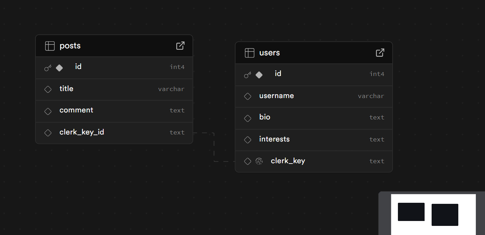
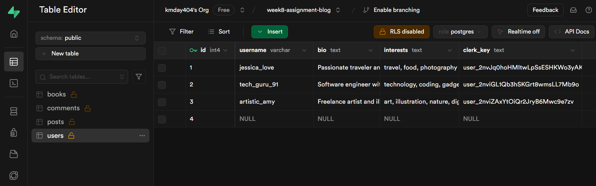

# Planning

- Concept and problem domain
- Wireframe
- Database schema
- You need at least 2 tables (users and posts, for example)
- One to many -- > one user, many posts
- foreign key shoud go in the many table

  - Your foreign key should reference the clerk_id in the one table

  # set up your app folder

  # set up Clerk

